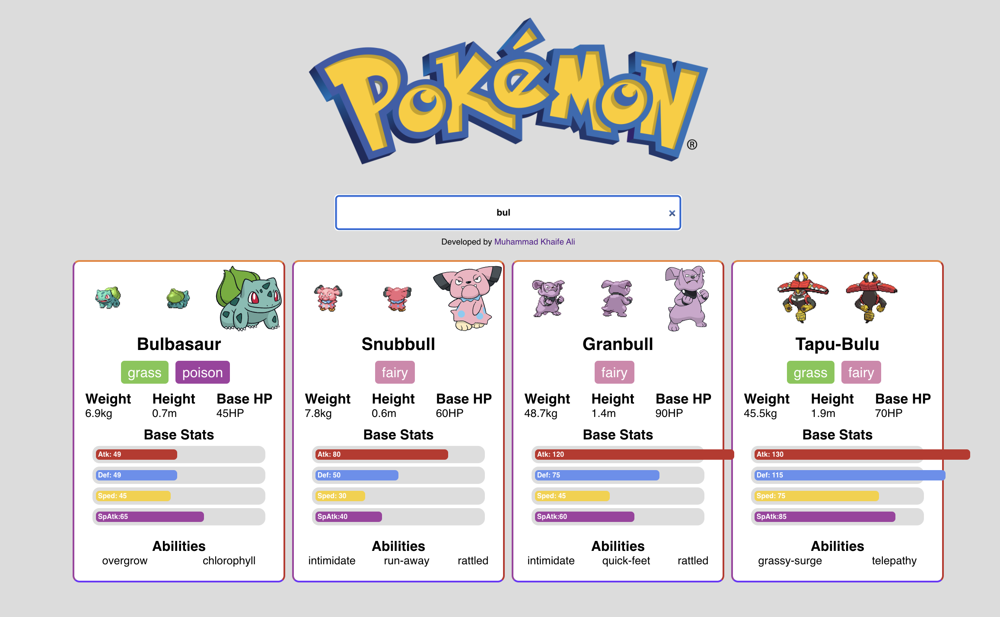

# Pokemon React App

This is a simple application that uses the following Pokemon API: "https://pokeapi.co/api/v2/pokemon/"

List of Pokemon on the basis of React.

I included the additional query of limiting a 1000 Pokemon to the initial search "?limit=1000".

## My Customisations

Users will see a Loading Screen while the data is fetched from the Pokemon API.

Initially it will show the full list of Pokemon available then users can view limited to the first 1000 Pokemon available in individual cards.

Users are able to see key information about the Pokemon including:

- Pokemon Name
- Weight, Height Base HP
- Pokemon Type
- Base Stats with bar graph visual of attack stat, defene, speed and special attack stat.
- List of 2 abilities.

Users can then search through the different Pokemon present via the search bar as shown below.

Then the options of Pokemon shown will be limited that have in their name the order of letters typed into the Search Bar as shown below.

The website is dynamic and responsive to screen size.

Small Screen Size

Medium Screen Size

Large Screen Size

## Future changes

- Incorporate React Styled Components and include some animation as the website is fairly static.
- Include Additional Information when card is clicked i.e evolution chain.
- Include Pokemon SVG Icons.
- Include Dark Mode Toggle.
- Better Lazy Loading of Images.
- Make it possible to search Pokemon by Type.
- Incorporate Scroll to Top.

## Credits

[Pokemon API](https://pokeapi.co/docs/v2)
